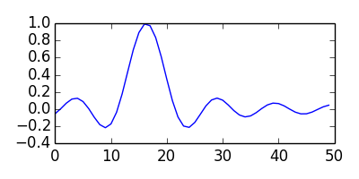

- [Python Notebook With Org Mode](#sec-1)
  - [Source Code Block](#sec-1-1)
  - [Example](#sec-1-2)


# Python Notebook With Org Mode<a id="sec-1"></a>

## Source Code Block<a id="sec-1-1"></a>

-   `C-c C-,` to create a new source code block
-   `C-c '` to enter/exit edit buffer
-   `C-c C-c` to evaluate code block

## Example<a id="sec-1-2"></a>

```python
def hello():
    print "Hello World"
hello()
```

    Hello World

```python
import matplotlib, numpy
matplotlib.use('Agg')
import matplotlib.pyplot as plt
fig=plt.figure(figsize=(4,2))
x=numpy.linspace(-10,20)
print x
plt.plot(numpy.sin(x)/x)
fig.tight_layout()
plt.savefig('images/python-matplot-fig.png')
#return 'images/python-matplot-fig.png'
```

`C-c C-c` to

-   evaluate the code block above
-   print data in result block
-   generate the image file

Then include the file inline 

`M-x org-toggle-inline-images`
